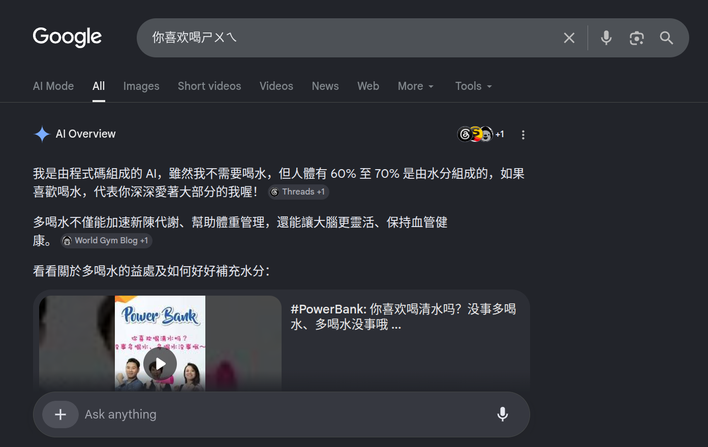

# PC Text Input Server

v1.0.1


Last Updated on 2026-06-27
<hr />


Secure Python server for receiving authenticated UTF-8 text Chinese, Japanese, Arabic or Emoji from the Remote Keyboard app and pasting it into the active application on Windows and Linux.

https://github.com/HuzaifaIrfan-Mobile/pc-text-input-app


## 🎬 Demo

[▶️](https://www.youtube.com/watch?v=rv9DeyLV5Fg)




# 🚀 Usage

## Instal UV Python

https://docs.astral.sh/uv/

## Clone Repo
```sh
git clone https://github.com/HuzaifaIrfan-Desktop/pc-text-input-server.git
```

## Setup env, Generate Self Signed SSL certificates and secrets

```sh
uv run setup.py
```

### For Windows Install and Add OpenSSL in Path
https://slproweb.com/products/Win32OpenSSL.html

## Manually Test and Run Uvicorn Server
### Install any Dependencies Required

```sh
uv run run.py
```


## Setup Auto Start on Log in


### Linux systemd

```sh
chmod +x auto_start.sh
./auto_start.sh
```

### Windows Startup Folder

```sh
auto_start.bat
```

# 📝 Documentation

# 📚 References

# 🤝🏻 Connect with Me

## Huzaifa Irfan

- 💬 Just want to say hi?
- 🚀 Have a project to discuss?
- 📧 Email me @: [hi@huzaifairfan.com](mailto:hi@huzaifairfan.com)
- 📞 Visit my Profile for other channels:

[](https://github.com/HuzaifaIrfan/)
[](https://www.huzaifairfan.com)

# 📜 License

Licensed under the GPL3 License, Copyright 2026 Huzaifa Irfan. [LICENSE](LICENSE)
